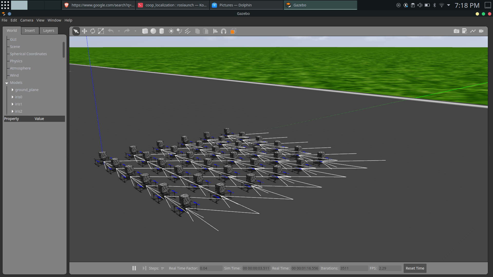
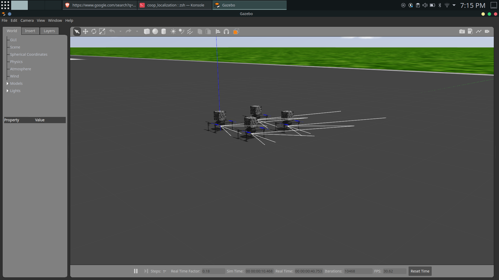

# Co-OpLocalization

A co-operative QR landmark based localization for Swarm of FLSs. 

Our system will involve FLSs with a cube of QR codes attached to their bottom. 
Each FLS will have a unique ID and their ID will be encoded in their QR codes. 
For any 360 camera, we will process the stream of images and identify the list of QR codes that are valid and in the frame. 
We will extract their ID and cross reference it against our database to identify the FLS. 
Once we have identified the FLS we will query that FLS using MAVLink to obtain their status. 
If an FLS is in its designated position then we can use their coordinates as support points for estimating distance of our FLS, else we will simply discard it. 
Once we have at least 3 FLS and their distances we can compute the position of our FLS by triangulation.

For computing the distance of an FLS using camera images we will have to first identify the corner points of QR code using computer vision techniques such as Harris Corner detection etc. 
Once we have the four corner points of the QR code and the actual size of the QR code (known to us when we generate and print the QR code) we can solve for distance between the camera & FLS in view.

In reality when we compute distances using techniques such as Dead Reckoning or Visual Odometry it is bound to produce errors. 
Since errors get accumulated over time and can lead to skewed position results we have to constantly correct those errors from sensor computations. 
For this process we will be utilizing a Kalman Filter to improve our estimates.

The novelty of this project would be to utilize QR landmarks on neighboring drones to identify the relative camera pose with respect to the neighboring drones and fuse them using the Extended Kalman Filter (EKF) to improve the accuracy of localization and prevent drifts. 
Using computer vision techniques we can obtain the relative measurement between two FLSs.

# Steps to install the system

1. Follow steps at [link](http://wiki.ros.org/noetic/Installation/Ubuntu) and install ROS

2. Create the following folder structure 
```bash
mkdir -p ~/catkin_ws/src
```
3. Clone ardupilot repository into ~/catkin_ws/src
```bash
git clone https://github.com/ArduPilot/ardupilot.git
cd ardupilot
```
4. Run following script to install prereqs
```bash
Tools/environment_install/install-prereqs-ubuntu.sh -y
```
5. Source .profile
```bash
source ~/.profile
```
6. Checkout latest ArduCopter build
```bash
git checkout Copter-4.2
```
7. Install submodules
```bash
git submodule update --init --recursive
```
8. Run ArduCopter SITL once to init values
```bash
cd ~/catkin_ws/src/ardupilot/ArduCopter
sim_vehicle.py -w
```
9. Install ArduPilot plugin for Gazebo
```bash
cd ~/catkin_ws/src
git clone https://github.com/khancyr/ardupilot_gazebo.git
cd ardupilot_gazebo
```
10. Build and install plugin
```bash
mkdir build
cd build
cmake ..
make -j4
sudo make install
```
11. Add gazebo sourcing to .bashrc or .zshrc
```bash
echo 'source /usr/share/gazebo/setup.sh' >> ~/.bashrc
```
12. Git clone the current repository and rename it
```bash
cd ~/catkin_ws/src
git clone https://github.com/dheeraj-coding/Co-OpLocalization.git
mv Co-OpLocalization coop_localization
```
14. Install catkin tools from this [link](https://catkin-tools.readthedocs.io/en/latest/installing.html)

15. Add catkin_ws sourcing to .bashrc or .zshrc
```bash
echo 'source ~/catkin_ws/devel/setup.bash'
source ~/.bashrc
```

16. Add model source paths
```bash
echo 'export GAZEBO_MODEL_PATH=~/ardupilot_gazebo/models' >> ~/.bashrc
echo 'export GAZEBO_MODEL_PATH=${GAZEBO_MODEL_PATH}:$HOME/catkin_ws/src/coop_localization/models' >> ~/.bashrc
source ~/.bashrc
```
17. Run python script to generate drone models
```bash
cd ~/catkin_ws/src/coop_localization/scripts/
chmod +x generate_drone_grid.py
python3 generate_drone_grid.py --rows=2 --cols=2 --path={FULLPATH-TO-CATKIN_WS}/src/coop_localization/worlds/runway.world --modelpath={FULLPATH-TO-CATKIN_WS}/src/coop_localization/models/
```
18. roslaunch runway model to see drones in gazebo
```bash
roslaunch coop_localization runway.launch
```
## Simulation Environment images that can generate any number of drones in a square grid.



19. to run multi drone with mavros communication install 
```bash
sudo apt-get install konsole
```
20. generate necessary launch files like this:
```bash
python3 generate_launch_files.py --numdrones=<num> --outputpath=<PATHTOLAUNCHFOLDER>
```
21. generate transform publishers:
```bash
python3 generate_transforms.py --rows=2 --cols=3 --path=<PATHTOLAUNCHFOLDER>
```
22. launch simulation using:
```bash
roslaunch coop_localization runway.launch
```
23. start the drone nodes:
```bash
./ardulaunch.sh
```
24. enable MALink Communication:
```bash
roslaunch coop_localization multi_mavros.launch
```
25. launch static transforms:
```bash
roslaunch coop_localization transforms.launch
```
26. launch tf publisher
```bash
rosrun coop_localization tf_publisher.py _num:=<numofdrones>
```
27. to launch all drones simultaneously run:
```bash
roslaunch coop_localization multi_drone.launch
```
28. for octahedron shape:
```bash
./octahedron.sh
```
29. for prism shape:
```bash
./prism.sh
```
30. To observe localization information:
```bash
rostopic echo /iris<id>/camestimator/pointInfo
```
